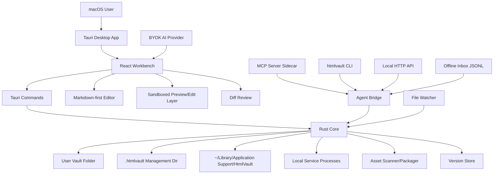

# HTML Native Notes Desktop Technical Design

Date: 2026-06-26
Status: Corrected PRD-aligned desktop plan
Scope root: `/Users/siter/Documents/HTML原生笔记编辑器/html-native-notes`
Authoritative PRD: `/Users/siter/Documents/需求池项目/research/ai-html-notes-prd.html`

## 0. Correction

The current codebase is a local React/Fastify web prototype. It is not the PRD-complete product.

The PRD requires a macOS desktop app for an AI HTML Vault: local-first, source-guarded, agent-addressable, versioned, Markdown-editable, service-aware, exportable, and publishable. This document replaces the previous web-v0 design with the desktop architecture needed to implement the PRD.

All code, docs, config, tests, generated fixtures, and build outputs stay inside this folder unless explicitly noted as runtime user data under macOS Application Support or a user-selected Vault.

## 1. Product And PRD Summary

### 1.1 Positioning

HTML Native Notes is a macOS desktop app for AI-generated HTML documents, local dashboards, Markdown notes, and web project assets. It is not a generic file manager and not a web-only editor. The product turns scattered AI-created HTML and local service pages into a managed Vault with search, preview, service start/stop, version history, Markdown-style editing, backlinks, asset checks, and export/publish workflows.

### 1.2 V1 North Star

Within 7 days, 20 AI-agent generated pages and 3 local dashboards should enter one Vault automatically and become searchable, startable, versioned, rollback-capable, Markdown-editable, sync/export-ready, and shareable.

### 1.3 Non-Negotiable Red Line

Intake, indexing, preview, thumbnailing, asset scanning, and version initialization must not modify original HTML, Markdown, or project files. Only explicit user actions can write:

- edit
- organize
- write back
- save as
- export
- publish after confirmation

Every write-back path must show a diff and allow write back, save as, or cancel.

### 1.4 V1 Feature Scope

The V1 desktop app must include:

- Vault home with folder-like navigation, cards/list modes, thumbnails, titles, tags, update time, source, search, filters.
- Agent Bridge through MCP server, CLI, HTTP API, offline inbox, and file watching.
- Service Registry with cwd, start command, URL, port, health check, stop command, env hints, and log path.
- Runtime Manager that can health-check, start, stop, and show failure logs for app-started local services.
- Source Guard for immutable intake and explicit write gates.
- Version Engine with Git-like snapshots, external edit detection, source diff, content diff, DOM summary, rollback, branch/recover.
- Markdown-first editor with shortcuts, slash command, wikilinks, backlinks, tags, quick open, and HTML persistence.
- Markdown and existing asset import preserving frontmatter, images, wikilinks, tags, folder structure, code blocks, and source hashes.
- HTML Profile stored in `.ainote.html` documents and sidecar manifests.
- Page-in-place preview editing with text-node edits, diff on exit, write/save-as/cancel.
- Diary organization flow using user-configured AI, preserving the original input.
- BYOK AI configuration for OpenAI-compatible providers. No hardcoded secrets.
- Asset management for missing images, external CSS/JS, dangerous scripts, broken links, and safe static packaging.
- Export/publish paths for single file, folder package, Markdown, PDF, and static hosting adapter.
- macOS desktop first, Intel + Apple Silicon target, older macOS considered where dependencies allow.

## 2. Product Design Brief

Product Design context is explicit enough to proceed to architecture, but UI implementation still needs design review before final coding.

- Product: a macOS desktop knowledge workbench for HTML-native AI notes and local web assets.
- Visual source: Obsidian is the reference for information density, sidebar/workspace mental model, command palette, Markdown friendliness, and restrained editor feel. It is a reference, not a clone.
- Interaction level: full interactivity. Controls, menus, dialogs, service states, import states, diff states, edit states, and error states must work.
- Visual direction: polished native-adjacent desktop app, dense but calm, dark/light themes, clear panels, low visual noise, readable typography, reliable keyboard workflows.
- UI rule: all page interaction and visual changes must be treated as Product Design work and checked for layout quality, spacing, states, accessibility, and desktop ergonomics.

## 3. Technical Choice

### 3.1 Primary Stack

- Desktop shell: Tauri v2.
- Native core: Rust in `src-tauri/`.
- UI: React + TypeScript + Vite.
- Editor: Tiptap/ProseMirror for Markdown-first rich editing plus Markdown shortcuts.
- Source/code diff: Rust/TypeScript diff utilities with unified source diff and readable content diff.
- Persistence: user-selected Vault folder plus `.htmlvault/` management directory.
- Agent bridge: Node/TypeScript MCP server plus CLI and local HTTP bridge as sidecar processes managed by Tauri.
- Tests: Rust unit/integration, Vitest, Playwright browser tests, and Tauri desktop smoke/flow tests.

Official references to verify during implementation:

- Tauri macOS bundle and minimum system version: https://v2.tauri.app/distribute/macos-application-bundle/
- Tauri config reference: https://v2.tauri.app/reference/config/
- Tauri shell/sidecar plugin: https://v2.tauri.app/plugin/shell/
- Tauri filesystem plugin: https://v2.tauri.app/plugin/file-system/
- MCP TypeScript SDK: https://github.com/modelcontextprotocol/typescript-sdk

### 3.2 Why Tauri

Tauri matches the PRD because this app needs a small desktop runtime, native file access, process management, service start/stop, local sidecars, and a secure boundary between UI and system operations.

Rust owns the high-risk operations:

- filesystem scanning and hash verification
- no-write Source Guard enforcement
- snapshot and rollback
- service process lifecycle
- path canonicalization
- Application Support paths
- asset packaging

TypeScript owns product interaction:

- workspace layout
- editor state
- command palette
- import wizard
- diff review screens
- AI prompt flows
- MCP/HTTP/CLI bridge implementation where ecosystem support is stronger

### 3.3 Fallback Decision

Electron is only a fallback if Tauri blocks PRD-critical capabilities on the target macOS range. Missing local Rust tooling is not a product reason to choose Electron; it is an environment setup decision. Installing Rust modifies user-level toolchain directories, so it requires explicit user confirmation before implementation can build and run the Tauri app on this machine.

## 4. Architecture



### 4.1 Runtime Processes

- `html-native-notes.app`: main Tauri desktop app.
- `htmlvault-mcp`: MCP sidecar for agent tools/resources.
- `htmlvault-http`: local HTTP bridge sidecar for agent registration and health checks.
- `htmlvault`: CLI binary or Node sidecar for scripts and fallback registration.
- app-started service children: user-registered dashboards started from configured cwd/commands.

### 4.2 Storage Locations

User-visible Vault:

```text
<vault>/
  notes/
  imports/
  services/
  exports/
  .htmlvault/
    manifest.json
    index.sqlite
    inbox/
      requests.jsonl
    profiles/
    thumbnails/
    versions/
    assets/
    logs/
```

macOS Application Support:

```text
~/Library/Application Support/HtmlVault/
  config.json
  agent-inbox/
    requests.jsonl
  bridge/
    http-port.json
    mcp-status.json
  logs/
```

Application Support is runtime state, not repository source. The app must never store API keys in committed files. Local test keys may live only in ignored `.env.local` or OS-secure user config during testing.

## 5. Directory Structure

Planned source tree:

```text
html-native-notes/
  README.md
  package.json
  src-tauri/
    Cargo.toml
    tauri.conf.json
    capabilities/
      default.json
    src/
      main.rs
      commands/
        vault.rs
        import.rs
        version.rs
        service.rs
        source_guard.rs
        asset.rs
        publish.rs
        config.rs
      core/
        vault.rs
        profile.rs
        scanner.rs
        source_guard.rs
        version_store.rs
        service_registry.rs
        runtime_manager.rs
        asset_scan.rs
        exporter.rs
        errors.rs
      tests/
        fixtures.rs
  src/
    main.tsx
    app/
      App.tsx
      routes.ts
      shell/
      state/
    features/
      vault/
      import/
      editor/
      preview/
      diff/
      agent-bridge/
      services/
      versions/
      assets/
      publish/
      diary/
      settings/
    shared/
      api/
      ui/
      types/
      shortcuts/
  bridge/
    mcp/
      server.ts
      tools.ts
      resources.ts
    http/
      server.ts
      routes.ts
    cli/
      index.ts
      commands/
    shared/
      protocol.ts
  tests/
    unit/
    integration/
    e2e/
    fixtures/
      mixed-100/
      markdown-30/
      services/
      dangerous-assets/
  docs/
    TECHNICAL_DESIGN.md
    PRD_GAP_AUDIT.md
    PRD_REQUIREMENTS_MATRIX.md
    TEST_REPORT.md
    SECURITY_REVIEW.md
    superpowers/
      plans/
```

## 6. Module Boundaries

### 6.1 Rust Core

- `vault`: create/open Vault, maintain manifest, normalize asset IDs.
- `profile`: read/write `.ainote.html` profile metadata and sidecar manifests.
- `scanner`: read-only directory scanner for HTML, Markdown, package.json, static assets, and service candidates.
- `source_guard`: canonical path checks, content hashing, write intent validation, and no-write proofs.
- `version_store`: snapshots, external change detection, source diff, content diff, DOM summary, rollback, branch/recover.
- `service_registry`: service asset schema, cwd/command/url/port/log/env hints.
- `runtime_manager`: health check, start, stop, log capture, process tracking.
- `asset_scan`: missing files, external links, dangerous scripts, unpublishable resources, safe package plan.
- `exporter`: single-file export, folder package, Markdown export, PDF export handoff.
- `publish`: static hosting adapter boundary; V1 supports local package and provider hooks without hardcoded credentials.

### 6.2 React UI

- `vault`: workspace home, tree/list/cards, search, filters, thumbnails.
- `import`: read-only import wizard, hash confirmation, Markdown template choice.
- `editor`: Markdown-first editing, shortcuts, slash commands, wikilinks, backlinks, tags, quick open.
- `preview`: sandboxed preview, page-in-place text edit overlay, safe mode indicators.
- `diff`: write gate, source diff, content diff, DOM summary, screenshot hint.
- `agent-bridge`: bridge status, inbox queue, registration logs.
- `services`: registered dashboards, health, start/stop, cwd/log display.
- `versions`: timeline, external change markers, rollback/recover.
- `assets`: asset integrity report and safe packaging.
- `publish`: export and publish flows.
- `diary`: AI diary organization with preserved original.
- `settings`: Vault path, AI provider, bridge ports, theme, security policy.

### 6.3 Bridge Modules

- MCP tools: `registerHtmlAsset`, `registerWebService`, `searchVault`, `createNote`, `snapshot`, `publish`, `importExisting`.
- MCP resources: Vault manifest, note profiles, asset summaries, service states.
- HTTP API: local-only agent registration and search endpoints.
- CLI: scriptable fallback matching the HTTP/MCP registration model.
- Offline inbox: JSONL requests read at app startup and on file watch.

## 7. Data Models

### 7.1 Vault Manifest

```ts
interface VaultManifest {
  schemaVersion: 1;
  vaultId: string;
  createdAt: string;
  updatedAt: string;
  assets: VaultAssetSummary[];
  settings: {
    defaultTemplateId: string;
    sourceGuardMode: "strict";
  };
}
```

### 7.2 Vault Asset

```ts
interface VaultAssetSummary {
  id: string;
  kind: "html-note" | "markdown-note" | "service" | "project" | "diary";
  title: string;
  sourcePath?: string;
  vaultPath: string;
  sourceHash?: string;
  profilePath: string;
  thumbnailPath?: string;
  tags: string[];
  source: "manual" | "mcp" | "cli" | "http" | "inbox" | "watcher" | "import";
  createdAt: string;
  updatedAt: string;
  lastSnapshotId?: string;
}
```

### 7.3 HTML Profile

```ts
interface HtmlProfile {
  schemaVersion: 1;
  assetId: string;
  title: string;
  source: VaultAssetSummary["source"];
  sourcePath?: string;
  sourceHash?: string;
  blockIds: Record<string, string>;
  assetManifest: AssetManifestItem[];
  aiContext: {
    summary?: string;
    tags: string[];
    sourceAgent?: string;
  };
  themeVars: Record<string, string>;
  version: {
    currentSnapshotId: string;
    baselineSnapshotId: string;
  };
}
```

### 7.4 Service Registration

```ts
interface WebServiceRegistration {
  id: string;
  title: string;
  cwd: string;
  startCommand: string;
  stopCommand?: string;
  url: string;
  port?: number;
  healthCheckUrl?: string;
  envHints: string[];
  logPath: string;
  startedByApp: boolean;
}
```

### 7.5 Agent Inbox Request

```ts
interface AgentInboxRequest {
  requestId: string;
  type: "registerHtmlAsset" | "registerWebService" | "snapshot" | "importExisting";
  createdAt: string;
  sourceAgent?: string;
  sourcePath?: string;
  sourceHash?: string;
  title?: string;
  tags?: string[];
  service?: Partial<WebServiceRegistration>;
  metadata?: Record<string, unknown>;
}
```

### 7.6 Current TypeScript Version API Contract

The current non-Rust implementation exposes the first usable Version Engine boundary through the local Fastify API and React shell:

```ts
interface VaultVersionSnapshot {
  snapshotId: string;
  assetId: string;
  reason: string;
  createdAt: string;
  contentHash: string;
  contentPath: string;
}

interface VaultVersionDiff {
  source: { added: string[]; removed: string[] };
  content: { added: string[]; removed: string[] };
  domSummary: {
    addedTags: string[];
    removedTags: string[];
    changedTitle?: { from: string; to: string };
  };
}
```

Implementation files:

- `bridge/vault/versionStore.ts`: snapshot list/create, source diff, readable content diff, DOM summary, rollback.
- `src/server/routes/vault.ts`: local API wrappers with Vault source boundary checks before snapshot and rollback writes.
- `src/shared/api/client.ts`: renderer API client methods for list/diff/rollback.
- `src/app/App.tsx`: loads versions with preview, compares latest two snapshots, rolls back and refreshes preview.
- `src/features/vault/VaultHome.tsx`: compact timeline, compare action, rollback action, source/content/DOM diff panel.

Security notes:

- Version `assetId` values are restricted to safe `asset_*` path segments before they can reach the version store.
- Snapshot content is read only after `realpath` proves it is still inside `.htmlvault/versions/<assetId>/`.
- API responses omit internal snapshot `contentPath` values from renderer-facing version metadata.
- Renderer version operations use request tokens so late compare/rollback responses cannot update the UI after the user starts opening another asset.

## 8. Data Flows

### 8.1 Agent HTML Enters Vault

1. Agent creates an HTML file in any working directory.
2. Agent skill calls MCP `registerHtmlAsset`.
3. If MCP is unavailable, skill calls local HTTP API.
4. If HTTP is unavailable, skill calls `htmlvault register`.
5. If CLI is unavailable, skill appends JSONL request to offline inbox.
6. App validates request, canonicalizes path, reads content hash, creates baseline snapshot, writes Vault metadata only, generates thumbnail/profile, and shows the asset in the Vault.
7. Original source hash is rechecked after intake to prove no mutation.

### 8.2 Existing Folder Import

1. User selects folder in desktop import wizard.
2. Rust scanner walks files read-only and detects HTML, Markdown, package.json, assets, and services.
3. UI shows candidates, warnings, hashes, templates, and import plan.
4. User confirms selected assets.
5. App writes only Vault metadata, profiles, thumbnails, version baselines, and copied generated Vault notes where the user explicitly chose conversion.
6. Tests compare original hashes before/after.

### 8.3 Markdown Editing Saved As HTML

1. User opens an asset in editor.
2. Editor loads HTML profile and editable document state.
3. Markdown shortcuts, slash commands, `[[wikilinks]]`, tags, and backlinks update an internal document model.
4. Save creates a new snapshot and updates the managed `.ainote.html` document.
5. If the asset has an original source path, write-back requires diff review and explicit action.

### 8.4 Page-In-Place Edit

1. User clicks Edit in preview.
2. Preview enters a sandboxed edit overlay for text nodes.
3. User edits visible text.
4. Exit computes patch and snapshot.
5. Diff screen offers write back, save as, or cancel.
6. No edit helpers are permanently injected into original HTML.

### 8.5 Service Launch

1. User opens service asset.
2. Runtime manager health-checks URL/port.
3. If down, app asks to start or auto-starts based on user preference.
4. Rust starts process in configured cwd with env hints and captures logs.
5. UI shows running/down/failed states, command, cwd, log path, and stop button.
6. Stop only targets app-started processes unless user explicitly configured a stop command.

### 8.6 Version And External Edit

1. File watcher sees source path changed.
2. Source Guard reads new hash and compares with last snapshot.
3. Version Engine creates an external-change snapshot.
4. UI shows timeline entry and diff.
5. Rollback restores the managed Vault copy or prepares explicit source write-back through diff gate.

Current TypeScript flow:

1. Bridge intake creates a baseline snapshot for registered HTML assets.
2. `POST /api/vault/assets/:assetId/versions/snapshot` creates an explicit snapshot from the current registered source.
3. Opening a Vault preview loads `GET /source` and `GET /versions`.
4. The timeline compares the latest two snapshots through `GET /versions/diff?from=...&to=...`.
5. Rollback calls `POST /versions/rollback`, writes the selected snapshot back to the registered source path after Vault boundary checks, then refreshes preview source and timeline.

## 9. Interface Design

### 9.1 Tauri Commands

Rust command boundary:

```ts
type TauriCommand =
  | "vault_create"
  | "vault_open"
  | "vault_search"
  | "import_scan"
  | "import_commit"
  | "asset_open"
  | "asset_save_snapshot"
  | "asset_prepare_writeback"
  | "asset_writeback"
  | "asset_save_as"
  | "version_list"
  | "version_diff"
  | "version_rollback"
  | "service_register"
  | "service_health"
  | "service_start"
  | "service_stop"
  | "asset_scan_integrity"
  | "export_asset"
  | "publish_asset"
  | "config_get_safe"
  | "config_save_ai";
```

### 9.2 HTTP API

Local-only, bound to `127.0.0.1`:

- `GET /health`
- `POST /api/agent/register-html`
- `POST /api/agent/register-service`
- `POST /api/agent/snapshot`
- `POST /api/agent/import-existing`
- `GET /api/vault/search?q=...`
- `GET /api/vault/resources`
- `GET /api/vault/library`
- `GET /api/vault/assets/:assetId/source`
- `GET /api/vault/assets/:assetId/versions`
- `POST /api/vault/assets/:assetId/versions/snapshot`
- `GET /api/vault/assets/:assetId/versions/diff?from=<snapshotId>&to=<snapshotId>`
- `POST /api/vault/assets/:assetId/versions/rollback`
- `POST /api/vault/assets/:assetId/write-review`
- `POST /api/vault/write-decision`

Every mutating endpoint validates path, source hash, request ID, and Vault scope. It does not modify original source files.

Current exception: rollback is an explicit user write path. It validates the registered source path stays inside the configured Vault before restoring snapshot content.

### 9.3 CLI

Commands:

```bash
htmlvault register --file ./report.html --title "Report" --tag ai --source-agent codex
htmlvault service register --cwd ./dashboard --start "npm run dev" --url http://127.0.0.1:5173
htmlvault snapshot --file ./report.html --reason external-agent-edit
htmlvault publish --asset <asset-id> --target local-package
htmlvault import --path ./old-notes
```

### 9.4 MCP Tools

Tool contracts:

- `registerHtmlAsset({ filePath, title, tags, sourceAgent, summary })`
- `registerWebService({ cwd, startCommand, url, port, healthCheckUrl, envHints, title })`
- `searchVault({ query, tags, kind })`
- `createNote({ title, markdown, templateId, tags })`
- `snapshot({ assetIdOrPath, reason })`
- `publish({ assetId, target, options })`
- `importExisting({ path, mode })`

## 10. Configuration

### 10.1 Repo Config

Committed:

- `.env.example` with placeholder provider fields.
- `tauri.conf.json` without secrets.
- bridge defaults without credentials.
- test fixture config only.

Ignored:

- `.env.local`
- `dist/`
- `target/`
- generated fixtures/output
- Playwright/Tauri reports

### 10.2 User Runtime Config

Safe config lives in:

```text
~/Library/Application Support/HtmlVault/config.json
```

Sensitive config rules:

- API keys are never written to committed files.
- The app may read `.env.local` during development tests.
- Production desktop storage should use a secure OS-backed secret store where practical; until then, store only provider presence/status and ask user to re-enter keys for sensitive flows.
- AI provider fields: base URL, model name, API key, temperature, max tokens, optional headers.

### 10.3 Current Environment Blocker

This machine currently has Node/npm but no `rustc` or `cargo` in PATH. Tauri implementation and desktop self-test require Rust. Installing Rust modifies user-level toolchain directories such as `~/.cargo`, so it needs explicit user confirmation before implementation can build locally.

## 11. Test Plan

### 11.1 Test Layers

- Rust unit tests: path safety, hashing, Source Guard, scanner, profiles, version store, service registry, asset scanner.
- Rust integration tests: import folders, snapshots, rollback, service lifecycle with fixture servers.
- TypeScript unit tests: editor commands, UI state reducers, bridge protocol validation, settings validation.
- React component tests: Vault views, import wizard, diff modal, service panel, asset report, diary panel.
- Bridge integration tests: MCP tool calls, HTTP API, CLI commands, offline inbox JSONL.
- Desktop smoke tests: launch Tauri app, open Vault, import fixtures, edit, diff, export.
- Scale acceptance tests: 100 mixed HTML/Markdown fixtures and 30 Markdown migration fixtures.
- Security tests: dangerous scripts, path traversal, external links, original hash unchanged, no secret exposure.

### 11.2 Acceptance Mapping

Detailed acceptance coverage lives in `docs/PRD_REQUIREMENTS_MATRIX.md`.

Minimum completion evidence:

- command output from all test suites
- generated test reports
- before/after source hashes for Source Guard tests
- screenshots for desktop launch, Vault home, import wizard, diff gate, service start/stop, asset report, publish/export
- AI test using a user-configured provider without committing the API key

### 11.3 Manual Desktop Self-Test

The final release candidate must be opened as a macOS desktop app. A browser-only run does not count.

Manual flow:

1. Launch app.
2. Create/open test Vault.
3. Generate an HTML file from the current AI working directory.
4. Register it through MCP/HTTP/CLI/inbox paths.
5. Confirm it appears in Vault within 10 seconds with source, summary, and thumbnail.
6. Import 100 mixed fixtures.
7. Import 30 Markdown fixtures.
8. Start and stop a fixture service.
9. Trigger external edit and verify snapshot/diff/rollback.
10. Use Markdown shortcut and `[[wikilink]]`.
11. Use page-in-place edit and cancel/write/save-as.
12. Run asset integrity check.
13. Export single file, folder package, Markdown, PDF path if supported.
14. Run publish/static package adapter and verify reachable target for configured provider.

## 12. Development Phases

### Phase 0: Reset And Environment Decision

- Keep existing web prototype only as reference.
- Commit gap audit and desktop design docs.
- Confirm Rust installation permission or choose Electron fallback.
- Create `src-tauri/` only after environment decision.

### Phase 1: Desktop Shell And Vault Core

- Tauri shell opens on macOS.
- Vault create/open/search works.
- Source Guard hashing and read-only import scan works.
- App launches in desktop self-test.

### Phase 2: Import, Profile, Version Engine

- HTML/Markdown/project scanner.
- `.ainote.html` profile.
- baseline snapshots.
- diff and rollback.
- 100 mixed fixture test.

### Phase 3: Agent Bridge

- MCP server tools/resources.
- HTTP API.
- CLI.
- offline inbox.
- file watcher.
- 10-second registration acceptance test.

### Phase 4: Editor And Preview

- Markdown-first editor.
- wikilinks/backlinks/tags/quick open.
- page-in-place edit.
- write-back diff gate.
- Markdown 30 fixture test.

### Phase 5: Services, Assets, Export, Publish

- service registry and runtime manager.
- asset integrity scanner.
- export package paths.
- publish/static hosting adapter.
- service start/stop acceptance tests.

### Phase 6: AI, Diary, Polish, Release Readiness

- BYOK AI flows.
- diary organization.
- Product Design UI polish.
- security review.
- full test report.
- GitHub repository update.

## 13. Completion Bar

This project is complete only when:

- The macOS desktop app launches.
- Every V1 PRD feature has implementation evidence.
- Every acceptance indicator in `docs/PRD_REQUIREMENTS_MATRIX.md` is verified or explicitly documented with an approved scope decision.
- The README describes desktop install/run/config/use/dev/test.
- No secrets are committed.
- The GitHub repository contains the corrected desktop implementation and test evidence.
