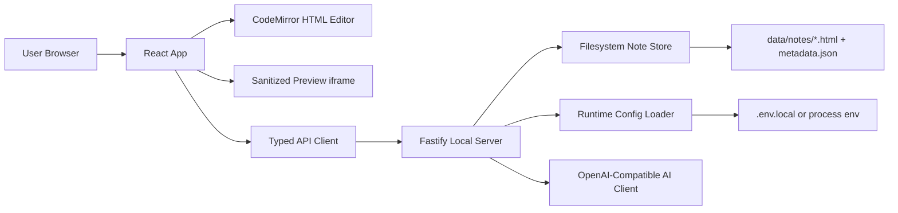

# HTML Native Notes Technical Design

Date: 2026-06-26
Status: Draft for review before implementation
Scope root: `/Users/siter/Documents/HTML原生笔记编辑器/html-native-notes`

## 1. PRD Reconstruction

### 1.1 Current Evidence

The project root currently contains only `.git`; no PRD, README, source code, or Markdown requirement document was found during the initial scan. This document therefore reconstructs PRD v0 from:

- The user objective in this thread.
- The prior product thesis that AI-era documents are moving from Markdown files toward richer HTML-native documents, while a next-generation HTML note engine / killer app is still missing.
- The explicit delivery requirements: local runnable open-source software, user-configured AI access, clear README, self-tests, and a future independent GitHub repository.

If a separate PRD exists outside this directory, it should be copied into `html-native-notes/docs/` before implementation and this document should be updated.

### 1.2 Product Positioning

HTML Native Notes is a local-first note editor for AI-era knowledge work. It treats HTML as the primary editable document format instead of a publish-only export target. The product should let users create, edit, preview, organize, and AI-transform self-contained HTML notes while keeping files portable and inspectable.

### 1.3 Target Users

- AI-heavy knowledge workers who increasingly receive generated HTML reports, dashboards, cards, and documents.
- Developers, researchers, and operators who want notes to preserve layout, semantic structure, media, code, tables, and interactive blocks.
- Open-source users who prefer local control and bring their own model/API provider.

### 1.4 Version 0 Goals

- Deliver a local web application that runs from a project-local dev command.
- Provide a two-pane HTML note workspace: file/library panel, editor panel, and live preview panel.
- Store notes in a local data directory controlled by the app, with import/export as `.html`.
- Support AI actions through user-provided configuration: base URL, API key, model name, temperature, max tokens.
- Avoid hardcoded secrets and avoid touching global system configuration.
- Include documentation, tests, and a basic security review checklist.

### 1.5 Version 0 Non-Goals

- No private commercial packaging.
- No cloud sync, auth, team collaboration, billing, or hosted backend.
- No browser extension.
- No WYSIWYG engine that attempts to match full Notion/Word behavior.
- No arbitrary script execution inside previews by default.

### 1.6 Core User Stories

- As a user, I can create a new HTML note from a template and see it in the library immediately.
- As a user, I can edit HTML source with formatting assistance and see a live sanitized preview.
- As a user, I can rename, duplicate, delete, restore, import, and export HTML notes.
- As a user, I can configure an OpenAI-compatible AI provider without changing source code.
- As a user, I can select text or a whole note and ask AI to summarize, rewrite, outline, translate, or generate an HTML section.
- As a developer, I can run unit, integration, and browser tests locally without requiring real API keys for most tests.

## 2. Technical Choice

### 2.1 Recommended Approach

Use a TypeScript full-stack local web app:

- Runtime: Node.js LTS.
- Frontend: React + Vite + TypeScript.
- Editor: CodeMirror 6 for HTML source editing.
- Preview: sanitized iframe preview.
- Backend: Fastify + TypeScript for local file APIs and AI proxy.
- Storage: filesystem JSON metadata plus `.html` note files.
- Tests: Vitest for unit/integration, Playwright for browser smoke tests.
- Lint/format: ESLint + Prettier.

This is the best fit for a complex local app because it keeps the first version open-source friendly, cross-platform, testable, and easy to run without Electron/private packaging.

### 2.2 Alternatives Considered

#### Option A: Pure Static Browser App

Pros: simplest deployment, no server process.
Cons: weak local filesystem support, awkward AI secret handling, import/export friction, limited persistent library behavior.

#### Option B: Electron/Tauri Desktop App

Pros: strongest local desktop experience.
Cons: packaging complexity, larger security surface, conflicts with current requirement to start open-source mode without private packaging.

#### Option C: Local Web App With Node Backend

Pros: strong file persistence, user-owned config, easy testing, no global system changes, later desktop packaging remains possible.
Cons: requires Node/npm and a local server command.

Chosen: Option C.

## 3. Architecture

### 3.1 High-Level Shape



### 3.2 Runtime Boundary

The browser never receives the raw AI API key. The frontend sends AI requests to the local backend, and the backend reads secrets from environment/config files.

In development mode, Fastify hosts the API and mounts Vite middleware for non-API routes only. Requests beginning with `/api/` bypass Vite so health checks and API calls always resolve through Fastify.

### 3.3 Security Boundary

- Preview HTML is sanitized before rendering.
- Preview runs in an iframe with a restrictive sandbox.
- Imported HTML scripts are removed or disabled in v0.
- File APIs are scoped to the app data directory.
- AI provider configuration is explicit and never committed.
- Vite file watching ignores `data/`, `test-results/`, and `playwright-report/` so note writes do not trigger development-page reloads.

## 4. Directory Structure

All files must live under `html-native-notes/`.

```text
html-native-notes/
  README.md
  package.json
  tsconfig.json
  vite.config.ts
  vitest.config.ts
  playwright.config.ts
  .env.example
  .env.local              # local only, gitignored
  .gitignore
  docs/
    TECHNICAL_DESIGN.md
    TEST_REPORT.md
    SECURITY_REVIEW.md
    superpowers/
      specs/
      plans/
  src/
    main.tsx
    app/
      App.tsx
      routes.ts
      state/
    features/
      notes/
      editor/
      preview/
      ai/
      settings/
    shared/
      api/
      ui/
      utils/
      types/
    server/
      index.ts
      config.ts
      routes/
      services/
      storage/
      ai/
      security/
  tests/
    unit/
    integration/
    e2e/
    fixtures/
  data/
    notes/
    trash/
    metadata.json
```

## 5. Module Split

### 5.1 Frontend Modules

- `features/notes`: library list, note CRUD actions, import/export UI.
- `features/editor`: CodeMirror editor, dirty state, keyboard commands, save flow.
- `features/preview`: HTML sanitization contract display, iframe rendering, preview error state.
- `features/ai`: prompt actions, selected-text context, streaming/non-streaming result handling.
- `features/settings`: AI provider config form and validation result display.
- `shared/api`: typed client wrapping backend endpoints.
- `shared/ui`: reusable buttons, dialogs, tabs, forms, toasts.

### 5.2 Backend Modules

- `server/config.ts`: loads env and runtime config, validates required values when AI is used.
- `server/storage/noteStore.ts`: scoped filesystem operations for notes and metadata.
- `server/routes/notes.ts`: note CRUD/import/export endpoints.
- `server/routes/ai.ts`: AI action endpoints.
- `server/routes/config.ts`: safe config status endpoint without exposing secrets.
- `server/ai/openAiCompatibleClient.ts`: provider-agnostic chat completion client.
- `server/security/htmlSanitizer.ts`: server-side sanitization for preview/export where needed.

`FileNoteStore` serializes metadata-changing operations through an instance-level write queue. This prevents concurrent browser sessions from losing notes through overlapping read-modify-write cycles on `metadata.json`.

## 6. Data Model

### 6.1 Note Metadata

```ts
export interface NoteMeta {
  id: string;
  title: string;
  slug: string;
  fileName: string;
  createdAt: string;
  updatedAt: string;
  tags: string[];
  archived: boolean;
}
```

### 6.2 Note Content

Each note is stored as a standalone `.html` file. Metadata lives in `data/metadata.json`.

### 6.3 AI Config

```ts
export interface AiRuntimeConfig {
  baseUrl: string;
  model: string;
  apiKey?: string;
  temperature: number;
  maxTokens: number;
}
```

The API key is optional at startup but required before real AI calls.

## 7. Data Flow

### 7.1 Create Note

1. User clicks create.
2. Frontend posts title/template to `POST /api/notes`.
3. Backend creates metadata and an HTML file under `data/notes/`.
4. Frontend refreshes library and opens the new note.

### 7.2 Edit and Save

1. Frontend loads note with `GET /api/notes/:id`.
2. User edits HTML in CodeMirror.
3. Preview updates locally using sanitizer.
4. Save sends content to `PUT /api/notes/:id/content`.
5. Backend writes file atomically and updates `updatedAt`.

### 7.3 AI Action

1. User selects action and optional text.
2. Frontend posts action, note context, and selection to `POST /api/ai/actions`.
3. Backend validates AI config and constructs an OpenAI-compatible request.
4. Backend returns generated text/HTML.
5. Frontend shows result in a review panel; user can insert or discard.

## 8. Interface Design

### 8.1 Notes API

- `GET /api/health` returns app status.
- `GET /api/notes` returns note metadata list.
- `POST /api/notes` creates a note.
- `GET /api/notes/:id` returns metadata and content.
- `PATCH /api/notes/:id` renames/tags/archives a note.
- `PUT /api/notes/:id/content` saves HTML content.
- `POST /api/notes/:id/duplicate` duplicates a note.
- `DELETE /api/notes/:id` moves a note to trash.
- `POST /api/import/html` imports an `.html` file.
- `GET /api/notes/:id/export` downloads an `.html` file.

### 8.2 AI API

- `GET /api/config/ai/status` returns `{ configured: boolean, baseUrlSet: boolean, model?: string }`.
- `POST /api/ai/actions` runs a supported action.
- `POST /api/ai/test` performs a small provider connectivity test.

Supported v0 AI actions:

- `summarize`
- `rewrite`
- `outline`
- `translate`
- `generate-section`
- `clean-html`

### 8.3 Error Contract

```ts
export interface ApiErrorBody {
  error: {
    code: string;
    message: string;
    details?: unknown;
  };
}
```

## 9. Configuration Plan

### 9.1 Files

- `.env.example`: committed template.
- `.env.local`: local-only test configuration, gitignored.
- Runtime environment variables override defaults.

### 9.2 Variables

- `AI_BASE_URL`: OpenAI-compatible API base URL.
- `AI_MODEL`: model name.
- `AI_API_KEY`: provider API key.
- `AI_TEMPERATURE`: numeric generation setting.
- `AI_MAX_TOKENS`: numeric output cap.
- `APP_HOST`: default `127.0.0.1`.
- `APP_PORT`: default `5178`.
- `DATA_DIR`: default `./data`.

### 9.3 Secret Handling

- No key appears in source, README, tests, committed fixtures, screenshots, or logs.
- Config status endpoints never return the key.
- Tests that need AI use `.env.local` only and are separated from default offline tests.

## 10. UI Design Principles

- First screen is the editor workspace, not a landing page.
- Dense but readable application layout: left library, center editor, right preview/AI/settings side panel.
- Stable panel dimensions and responsive collapse for narrow screens.
- Controls use recognizable icons and concise labels.
- No decorative marketing hero.
- Product Design rule: all page interaction, UI, visual polish, and experience changes should be treated as product-design work, not only functional code. The default visual direction is a polished professional editor: restrained, readable, dense enough for repeated work, and visibly intentional rather than plain scaffolding.

## 11. Testing Plan

### 11.1 Unit Tests

- Config loader validates defaults and rejects invalid numeric values.
- Note store creates unique IDs and safe filenames.
- Note store blocks path traversal outside `DATA_DIR`.
- HTML sanitizer strips scripts and dangerous attributes.
- AI request builder maps actions to provider messages.

### 11.2 Integration Tests

- Notes CRUD API: create, read, update content, rename, duplicate, delete.
- Import/export round trip for `.html`.
- AI config status hides secrets.
- AI test endpoint handles missing key, invalid provider response, and successful mock response.

### 11.3 E2E Tests

- App starts and health endpoint passes.
- User creates a note, edits HTML, sees preview update, saves, reloads, and content persists.
- User opens settings and sees AI configured status.
- User attempts an AI action with missing/invalid config and receives a clear error.

### 11.4 Manual Tests

- Start command from clean install.
- `.env.example` copy flow.
- DeepSeek live test using local `.env.local`.
- Browser test on desktop and one mobile/narrow viewport.
- Basic security check: imported script tag does not execute in preview.

## 12. Development and Verification Plan

Implementation should proceed in reversible slices:

1. Project scaffolding and scripts.
2. Config loader and secret-safe status API.
3. Filesystem note store with tests.
4. Notes API with integration tests.
5. Frontend shell and note library.
6. Editor and sanitized preview.
7. AI client and AI action review flow.
8. Import/export/trash polish.
9. README, security review, full self-test.
10. GitHub repository creation and push after user approval.

Each code behavior change should update this document or the implementation plan when the module contract changes.

## 13. Sub-Agent Boundary Plan

If parallel development is used, split work by bounded interfaces:

- Agent A: backend config, note store, and notes API.
- Agent B: frontend workspace, editor, preview, and UI state.
- Agent C: AI client, AI actions, settings, and config tests.
- Agent D: documentation, E2E tests, security checklist, and release readiness.

Shared contracts must be frozen before dispatch:

- `NoteMeta`
- Notes API endpoints
- AI config shape
- Error response shape

## 14. Open Questions

1. Should v0 use source-first editing only, or should it include a minimal visual editing mode?
2. Should notes be stored as full standalone HTML documents or HTML fragments wrapped at export time?
3. Should imported CSS be preserved inline, stripped, or sandboxed per note?
4. Should the default app language be Chinese, English, or bilingual?

Recommended defaults for v0:

- Source-first editing.
- Store standalone HTML documents.
- Preserve safe inline CSS, strip scripts.
- Chinese UI with English code/docs acceptable for open-source developer ergonomics.
